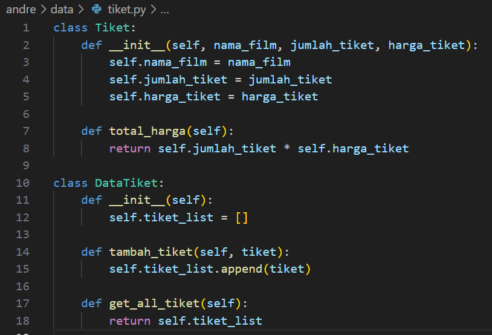
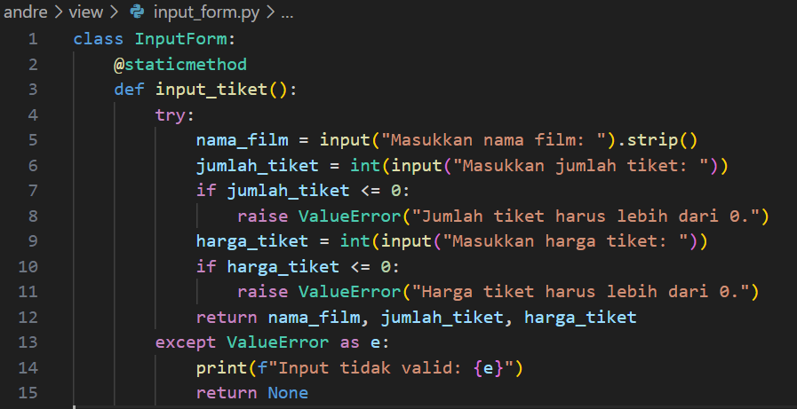
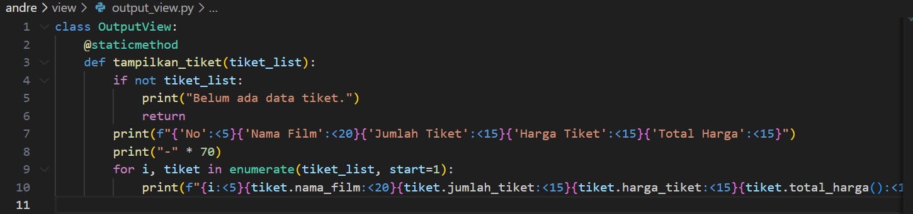
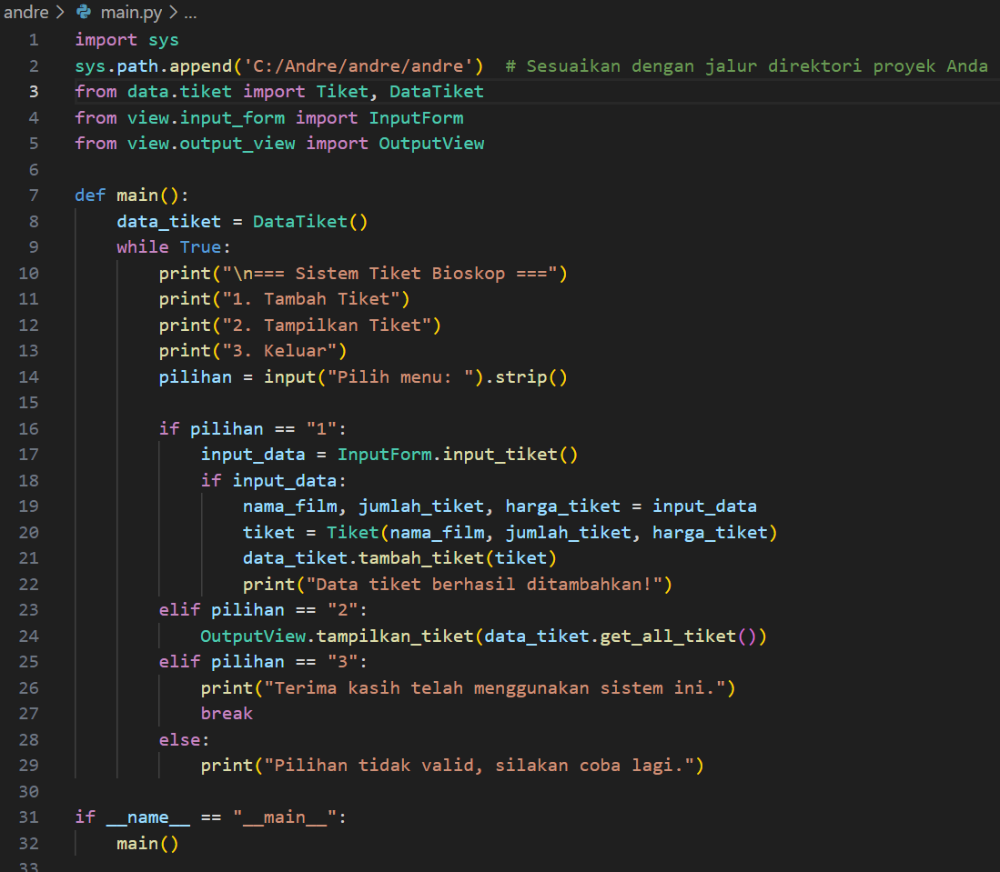

# PROJECT UAS

## CODE PROGRAM PEMESANAN TIKET BIOSKOP

### File tiket.py

File ini bertanggung jawab untuk mendefinisikan class Tiket dan DataTiket. Class Tiket merepresentasikan data terkait satu tiket bioskop. Konstruktor (__init__) dari class ini menerima tiga parameter: nama_film, jumlah_tiket, dan harga_tiket. Properti nama_film menyimpan nama film yang dipilih, jumlah_tiket menyimpan jumlah tiket yang dipesan, dan harga_tiket menyimpan harga satu tiket. Selain itu, class ini memiliki method total_harga, yang bertujuan untuk menghitung total harga tiket dengan mengalikan jumlah tiket yang dipesan dengan harga per tiket.

Class kedua, DataTiket, digunakan untuk mengelola kumpulan data tiket. Konstruktor class ini menginisialisasi properti tiket_list sebagai sebuah list kosong untuk menyimpan objek tiket. Method tambah_tiket menerima sebuah objek dari class Tiket dan menambahkannya ke dalam tiket_list. Sedangkan method get_all_tiket digunakan untuk mengambil semua data tiket yang tersimpan di dalam tiket_list.

### File main.py
File ini adalah program utama yang mengintegrasikan seluruh fungsi dari class yang ada di file tiket.py dan file lain seperti input_form.py dan output_view.py. Pada bagian awal, terdapat beberapa import yang digunakan untuk mengakses class Tiket, DataTiket, InputForm, dan OutputView. Class Tiket dan DataTiket diimpor dari folder data, sedangkan InputForm dan OutputView berasal dari folder view.

Fungsi utama dari file ini adalah fungsi main(). Di dalam fungsi ini, objek data_tiket dibuat sebagai instance dari class DataTiket untuk menyimpan semua data tiket selama program berjalan. Selanjutnya, program menampilkan menu utama kepada pengguna, dengan tiga opsi: menambah tiket, menampilkan tiket, atau keluar dari program. Opsi pertama (1) mengarahkan pengguna untuk menginput data tiket melalui method input_tiket yang diakses dari class InputForm. Setelah pengguna memasukkan data tiket (nama film, jumlah tiket, dan harga tiket), data tersebut digunakan untuk membuat objek baru dari class Tiket. Objek ini kemudian ditambahkan ke dalam data_tiket menggunakan method tambah_tiket.

Opsi kedua (2) digunakan untuk menampilkan daftar tiket yang sudah dimasukkan oleh pengguna. Data dari data_tiket diambil menggunakan method get_all_tiket, kemudian ditampilkan dengan memanfaatkan class OutputView. Opsi ketiga (3) digunakan untuk keluar dari program. Loop utama (while True) akan berhenti saat pengguna memilih opsi ini.

Penjelasan Logika Program
Program ini dibangun menggunakan pendekatan OOP (Object-Oriented Programming) dan konsep modular. Semua class dan fungsi dikelompokkan dalam file-file yang terpisah berdasarkan tanggung jawabnya, yaitu data.tiket untuk logika data, view.input_form untuk input data, dan view.output_view untuk menampilkan data. Konsep ini memungkinkan program lebih mudah dikelola dan dikembangkan di masa depan. Dengan validasi input dari pengguna (yang dilakukan di input_form) serta kemampuan untuk menampilkan data secara terorganisir (melalui output_view), program ini memenuhi syarat sebagai program yang modular, terstruktur, dan user-friendly.

## Kesimpulan
Program sistem tiket bioskop ini dirancang dengan pendekatan OOP (Object-Oriented Programming) dan modular, sehingga memiliki struktur yang rapi dan mudah dikelola. Setiap bagian program memiliki tanggung jawab spesifik yang dibagi ke dalam class dan file yang terpisah, seperti class Tiket untuk merepresentasikan data tiket, DataTiket untuk pengelolaan kumpulan tiket, InputForm untuk menerima input dari pengguna, dan OutputView untuk menampilkan data.

Pendekatan modular ini memberikan beberapa keunggulan, yaitu:

1. Kemudahan Pemeliharaan: Dengan membagi tugas ke dalam file dan class terpisah, program ini mudah diperbaiki atau dikembangkan tanpa memengaruhi seluruh bagian program.
2. Reusabilitas: Class dan fungsi yang telah dibuat dapat digunakan kembali di program lain yang serupa.
3. Keterbacaan: Struktur program lebih jelas, sehingga lebih mudah dipahami oleh pengembang lain.
4. Validasi Input: Dengan adanya validasi, program dapat menangani input yang salah dan mencegah error saat runtime.
5. Fungsionalitas yang Terintegrasi: Program menyediakan alur kerja yang lengkap, mulai dari memasukkan data tiket, menyimpan data tersebut, hingga menampilkannya dengan rapi.
6. Secara keseluruhan, program ini tidak hanya memenuhi ketentuan tugas, tetapi juga memberikan fondasi yang baik untuk pengembangan lebih lanjut, seperti penambahan fitur pencarian tiket, penyimpanan data ke file, atau tampilan berbasis GUI di masa depan.